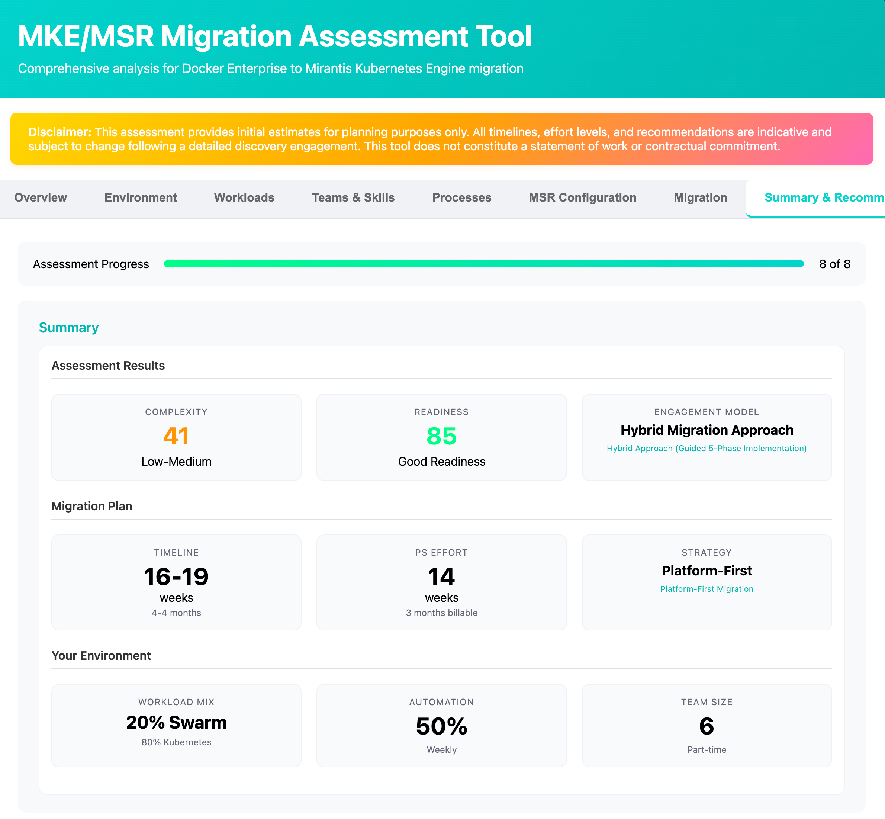

# Modular Journey Assessment Tool

> **Professional services engagement and timeline estimation for MKE/MSR infrastructure migrations**

A migration assessment platform that analyzes customer environments and recommends migration strategies for MKE (Mirantis Kubernetes Engine) and MSR (Mirantis Secure Registry) upgrades with Swarm-to-Kubernetes conversion support.

[](https://www.python.org/downloads/)
[](https://fastapi.tiangolo.com/)

---



---

## Features

- **Complexity Scoring** - Calculates migration difficulty (0-100 scale) based on 8 weighted factors
- **Engagement Model Classification** - Determines appropriate PS engagement (Advisory, Hybrid, Full Managed, Assessment-First)
- **Timeline Estimation** - Realistic timelines with min/max ranges using economy-of-scale models
- **Readiness Assessment** - Evaluates organizational preparedness
- **Rich Reporting** - Phase breakdowns, PS role assignments, warnings, and action items

---

## Quick Start

**Prerequisites:** Docker only

```bash
docker run -p 8000:8000 -p 8080:8080 ghcr.io/mirantis/modular-journey-assessment-tool:latest
```

Then open your browser to:
- **Web UI:** http://localhost:8080/assessment_ui.html
- **API:** http://localhost:8000
- **API Docs:** http://localhost:8000/docs

That's it! Start running assessments.

---

## Local Development Setup

For developers who want to modify the code:

```bash
# Clone and navigate
git clone <repository-url>
cd modular-journey-assessment-tool

# Create virtual environment
python -m venv venv
source venv/bin/activate  # On Windows: venv\Scripts\activate

# Install dependencies
pip install -r requirements.txt

# Start the application
./start.sh
```

**Access:**
- Web UI: http://localhost:8080/assessment_ui.html
- API: http://localhost:8000
- API Docs: http://localhost:8000/docs

---

## Usage

### Web Interface

1. Open http://localhost:8080/assessment_ui.html
2. Fill out the assessment form:
   - Company information
   - Environment details (MKE/MSR versions, infrastructure, scale)
   - Workload configuration (Swarm/K8s split)
   - Team skills (K8s experience, team size)
   - Process maturity (automation, deployment frequency)
3. Click "Generate Assessment"
4. Review results with complexity scores, timeline, and migration strategy

### API

```bash
curl -X POST "http://localhost:8000/api/assess" \
  -H "Content-Type: application/json" \
  -d '{
    "company_name": "ACME Corp",
    "industry": "Technology",
    "company_size": "enterprise",
    "msr_version": "2.8.0",
    "mke_version": "3.5.0",
    "infra_location": "onprem",
    "num_mke_instances": 3,
    "num_msr_instances": 2,
    "total_nodes": 120,
    "app_count": 150,
    "swarm_percent": 40,
    "kubernetes_percent": 60,
    "platform_team_size": 8,
    "k8s_experience": 4,
    "migration_exp": "some",
    "automation_level": 65,
    "deploy_frequency": "weekly"
  }'
```

**Response includes:**
- Complexity score and level
- Engagement model recommendation
- Timeline estimation (min/max months)
- Migration strategy with phases
- PS role breakdown
- Validation warnings and immediate actions

For complete API documentation, visit http://localhost:8000/docs

---

## Architecture

### Layered Design

```
┌─────────────────────────────────┐
│   assessment_ui.html (UI)       │
└──────────────┬──────────────────┘
               │ HTTP/REST
┌──────────────▼──────────────────┐
│   api.py (FastAPI)              │
└──────────────┬──────────────────┘
               │
    ┌──────────┴──────────┐
    │                     │
┌───▼──────┐      ┌──────▼─────────┐
│ Models   │      │ Business Logic │
│ inputs   │      │ engagement     │
│ outputs  │      │ complexity     │
│          │      │ details        │
└──────────┘      └────────────────┘
```

### Project Structure

```
modular-journey-assessment-tool/
├── api.py                      # FastAPI application
├── assessment_ui.html          # Web interface
├── models/                     # Data validation
│   ├── inputs.py              # Input models
│   └── outputs.py             # Result models
├── logic/                      # Business logic
│   ├── engagement.py          # Engagement classification
│   ├── complexity.py          # Complexity scoring
│   └── details_generator.py   # Report generation
└── tests/                      # Test suite
```

### Core Algorithms

**Engagement Models:**
- **Advisory (28% PS)** - Expert teams needing validation
- **Hybrid (63% PS)** - Skilled but time-constrained teams
- **Full Managed (88% PS)** - Overwhelmed organizations
- **Assessment-First** - Complex environments needing discovery

**Complexity Factors (0-100 scale):**
- MSR/MKE version gaps
- Air-gapped environment
- Infrastructure scale
- Swarm conversion needs
- Application count
- Team maturity

**Timeline Calculation:**
- Additive model for predictability
- Economy-of-scale for Swarm conversion (apps^0.7)
- Context-aware adjustments
- Risk-based buffer (5-13%)

---

## Development

### Running Tests

```bash
# Run all tests
./run_tests.sh

# Run specific test
pytest tests/test_engagement.py -v

# With coverage
pytest tests/ --cov=. --cov-report=html
```

### Code Quality

```bash
black .              # Format code
mypy .               # Type checking
ruff check .         # Linting
```

### Adding Features

**Example: Add security compliance factor**

1. **Add input field** (`models/inputs.py`):
```python
security_compliance: Literal['minimal', 'standard', 'high'] = 'standard'
```

2. **Add scoring logic** (`logic/complexity.py`):
```python
def _security_complexity(level: str) -> float:
    return {'high': 8, 'standard': 2, 'minimal': 0}[level]
```

3. **Add test** (`tests/test_comprehensive_scenarios.py`):
```python
def test_high_security_adds_complexity():
    inputs = AssessmentInputs(security_compliance='high', ...)
    score, _ = calculate_complexity_score(inputs)
    assert score >= expected_score
```

---

## Contributing

Contributions are welcome! Please:

1. Fork the repository
2. Create a feature branch
3. Make your changes
4. Run tests and code quality checks
5. Submit a pull request

**Code Standards:**
- Follow PEP 8
- Use Black for formatting
- Add type hints
- Include tests for new features
- Write descriptive commit messages

---

## Docker Deployment

### Build and Run Locally

```bash
# Build
docker build -t mke-assessment-tool .

# Run
docker run -d -p 8000:8000 -p 8080:8080 --name mke-assessment mke-assessment-tool
```

### Push to GitHub Container Registry

```bash
# Tag the image
docker tag mke-assessment-tool ghcr.io/YOUR_USERNAME/modular-journey-assessment-tool:latest

# Login to GitHub Container Registry
echo $GITHUB_TOKEN | docker login ghcr.io -u YOUR_USERNAME --password-stdin

# Push
docker push ghcr.io/YOUR_USERNAME/modular-journey-assessment-tool:latest
```

**Note:** Replace `YOUR_USERNAME` with your GitHub username. Create a personal access token with `write:packages` scope for `GITHUB_TOKEN`.

**Ports:**
- `8000` - REST API
- `8080` - Web UI

---

## License

Apache License 2.0

---

## Built With

- [FastAPI](https://fastapi.tiangolo.com/) - Web framework
- [Pydantic](https://pydantic-docs.helpmanual.io/) - Data validation
- [Uvicorn](https://www.uvicorn.org/) - ASGI server
